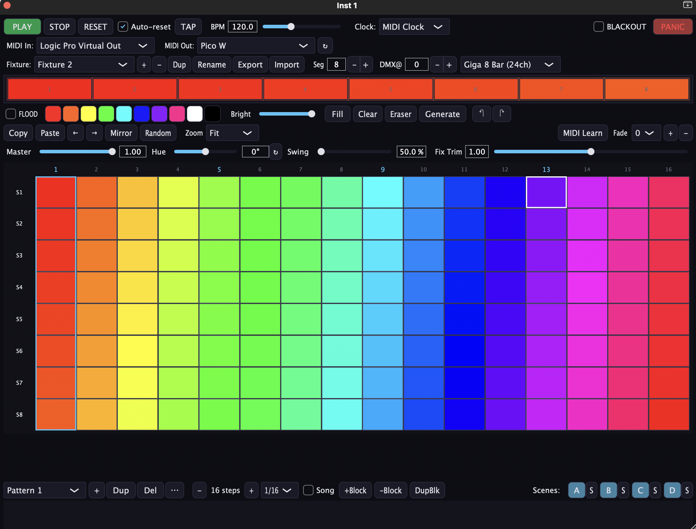

# LC-1X+ MIDI2DMX

**A JUCE MIDI FX plugin for controlling DMX lighting from your DAW.**

By Stephen McLeod (aka [allmyfriendsaresynths](https://www.youtube.com/c/allmyfriendsaresynths))

**Version:** 1.0 Beta
**Format:** Audio Unit MIDI FX Component (`.component`) — macOS Universal Binary (Apple Silicon + Intel)

> **Disclaimer:** This is an **unofficial** plugin. It is **not affiliated with, endorsed by, or supported by BoomLights**. The LC-1X+ hardware is their product; this plugin is an independent fan project designed to make it more fun to use inside a DAW.



---

## What it does

Inspired by the LC-1X+ MIDI to DMX converter from [BoomLights](https://www.boomlights.ca/), this plugin gives you a proper step-sequencer-style grid inside your DAW to let you control DMX lighting fixtures, synchronised via MIDI clock.

Draw patterns, flood colours, store scenes, and play whole lighting songs — all from a single plugin instance that sits on a MIDI track next to your music.

## Features

- **Step-sequencer grid** — paint colours across multi-segment fixtures, one step at a time
- **Multiple fixtures** — configure several LED bars or strips with independent segments
- **Pattern bank** — store, duplicate, reorder, and rename multiple patterns per fixture
- **Scenes A/B/C/D** — snapshot the whole grid state and recall instantly
- **Song mode** — chain patterns into a timeline that follows your DAW's transport
- **FLOOD mode** — toggle on, then tap a palette colour to override every fixture with a single live colour (great for one-hit stabs and manual overrides during a set)
- **Copy / paste / undo / redo** — per-pattern editing with history
- **Hue shift** — live global hue rotation with a recycle-reset button
- **Crossfade** — smooth between steps instead of hard-switching
- **Auto-reset on stop** — when the DAW (or external MIDI clock) stops, patterns snap back to step 1
- **MIDI clock sync** — locks to incoming MIDI clock for rock-solid timing
- **MIDI Learn** — map scenes, FLOOD, and transport to hardware controllers
- **State persistence** — everything saves with your DAW project

## How it works

The plugin is a MIDI FX — drop it on a MIDI track, route its output to a MIDI port that feeds your LC-1X+ (or any MIDI-to-DMX converter that understands the same protocol), and it will emit the MIDI messages needed to drive your DMX fixtures in sync with your session.

---

## Install (prebuilt, non-developers)

1. Grab the latest release from the [Releases page](https://github.com/clickysteve/LC-1X-Plus-MIDI-2-DMX-Plugin/releases).
2. Unzip `LC-1X-Plus-MIDI2DMX.component.zip`.
3. Move `LC-1X-Plus-MIDI2DMX.component` into:

   ```
   ~/Library/Audio/Plug-Ins/Components/
   ```

4. Because the component is not notarised, macOS will quarantine it. Strip the quarantine flag:

   ```bash
   xattr -cr ~/Library/Audio/Plug-Ins/Components/LC-1X-Plus-MIDI2DMX.component
   ```

5. (Optional) Force a rescan of the Audio Unit cache:

   ```bash
   killall -9 AudioComponentRegistrar
   ```

6. Relaunch Logic Pro (or your host). It should appear as a MIDI FX under **AMFAS → LC-1X+ MIDI2DMX**.

If Logic says the plugin failed validation, run `auval -v aumf Dmxl Amfs` in Terminal and check the output.

---

## Build from source (developers)

Requires: macOS, Xcode, CMake ≥ 3.22, and [JUCE](https://github.com/juce-framework/JUCE) (GPL build).

```bash
# 1. Clone this repo
git clone https://github.com/clickysteve/LC-1X-Plus-MIDI-2-DMX-Plugin.git
cd LC-1X-Plus-MIDI-2-DMX-Plugin

# 2. Clone JUCE into the project folder (JUCE is not vendored — GPL hygiene)
git clone --depth 1 https://github.com/juce-framework/JUCE.git

# 3. Configure and build
cmake -B build -G Xcode
cmake --build build --config Release

# 4. Install the AU component
cp -R "build/LC-1X-Plus-MIDI2DMX_artefacts/Release/AU/LC-1X-Plus-MIDI2DMX.component" \
      ~/Library/Audio/Plug-Ins/Components/
codesign --force --deep --sign - \
      ~/Library/Audio/Plug-Ins/Components/LC-1X-Plus-MIDI2DMX.component
killall -9 AudioComponentRegistrar
```

Then open Logic and validate:

```bash
auval -v aumf Dmxl Amfs
```

---

## Use in Logic Pro

1. Create a new **External MIDI** or **Software Instrument** track.
2. In the channel strip's **MIDI FX** slot, insert **AMFAS → LC-1X+ MIDI2DMX**.
3. In the plugin's MIDI output settings, route to the MIDI port connected to your LC-1X+.
4. Hit Play — the grid will step in time with Logic's transport.

---

## Known bugs

- Adding additional light fixtures may cause the plugin to crash.

---

## Disclaimer

This is an early beta release. It is provided **as-is, with no warranty of any kind**, express or implied. It may crash, lose state, misbehave in your host, or do unexpected things to your lights. Don't use it in a situation where a misfiring light cue could hurt anyone. Test thoroughly before any live use.

This project is **not affiliated with, endorsed by, or supported by BoomLights**. The LC-1X+ is their product; this plugin is an independent fan project designed to make it more fun to use inside a DAW.

Feedback, bug reports, and PRs welcome — open an issue on GitHub.

---

## Licence

This plugin is licenced under the **GNU General Public License v3.0**. See [LICENSE](LICENSE) for the full text.

Why GPL v3? Because the plugin is built on [JUCE](https://juce.com/), and using JUCE under its free licence requires the resulting project to be open-sourced under GPL v3. Any derivative work must also be GPL v3.

---

## Credits

- Built with [JUCE](https://juce.com/)
- Inspired by the [BoomLights LC-1X+](https://www.boomlights.ca/)
- Made by [allmyfriendsaresynths](https://www.youtube.com/c/allmyfriendsaresynths) (Stephen McLeod)
