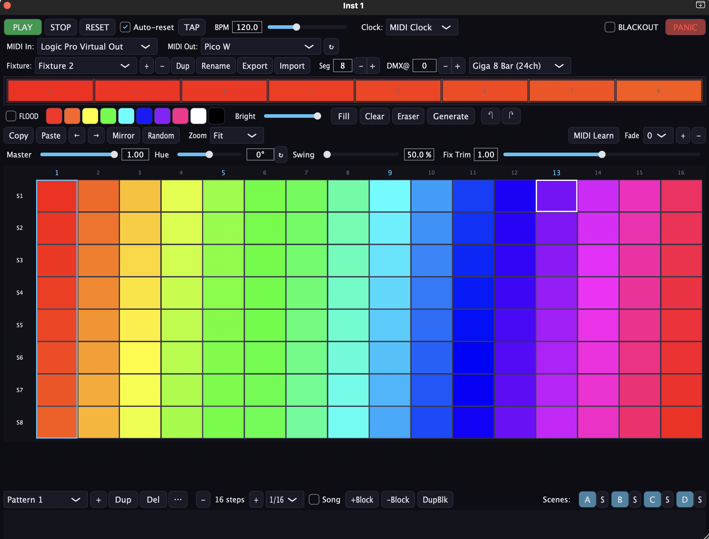

# LC-1X+ MIDI2DMX

**A JUCE MIDI FX plugin for controlling DMX lighting from your DAW.**

By Stephen McLeod (aka [allmyfriendsaresynths](https://www.youtube.com/c/allmyfriendsaresynths))

**Version:** 1.3.0
**Formats:** Audio Unit (`.component`) · VST3 (`.vst3`) · Standalone (`.app`) · Quick Light menu bar app
**Platforms:** macOS (Universal Binary — Apple Silicon + Intel, signed & notarised) · Windows (64-bit VST3 + Standalone, built via GitHub Actions)

> **Disclaimer:** This is an **unofficial** plugin. It is **not affiliated with, endorsed by, or supported by BoomLights**. The LC-1X+ hardware is their product; this plugin is an independent fan project designed to make it more fun to use inside a DAW.



---

## What it does

Inspired by the LC-1X+ MIDI to DMX converter from [BoomLights](https://www.boomlights.ca/), this plugin gives you a proper step-sequencer-style grid inside your DAW to let you control DMX lighting fixtures, synchronised to your session.

Draw patterns, flood colours, store scenes, and play whole lighting songs — all from a single plugin instance that sits on a MIDI track next to your music.

## Features

- **Step-sequencer grid** — paint colours across multi-segment fixtures, one step at a time
- **Multiple fixtures** — configure several LED bars or strips with independent segments
- **Pattern bank** — store, duplicate, reorder, and rename multiple patterns per fixture
- **Scenes A/B/C/D** — snapshot the whole grid state and recall instantly
- **Song mode** — chain patterns into a timeline that follows your DAW's transport
- **FLOOD mode** — toggle on, then tap a palette colour to override every fixture with a single live colour (great for one-hit stabs and manual overrides during a set)
- **FILL mode** — the same gesture scoped to one fixture, with each fixture keeping its own colour, so you can hold several different colours across the rig at once
- **Copy / paste / undo / redo** — per-pattern editing with history
- **Hue shift** — live global hue rotation with a recycle-reset button
- **Crossfade** — smooth between steps instead of hard-switching
- **Auto-reset on stop** — when the transport stops, patterns snap back to step 1
- **Three clock sources** — Internal, MIDI Clock, or **Host Sync**
- **Host-automatable parameters** — Master Dimmer, Hue, Swing, Blackout, Pattern and Flood all appear as automation lanes in your DAW
- **Record the show** — capture a live performance as a MIDI file and play it back from the DAW timeline without the plugin
- **MIDI Learn** — map scenes, FLOOD, and transport to hardware controllers
- **State persistence** — everything saves with your DAW project

### Sync

The **Clock** selector offers three sources:

| Source | Behaviour |
|---|---|
| Internal | Free-running at the plugin's own BPM. Useful without a host transport. |
| MIDI Clock | Locks to incoming MIDI clock, for hardware sequencers and external masters. |
| Host Sync | Derives every step from the host's musical position (PPQ). Sample-accurate, survives tempo changes, and re-locks instantly on loop and locate. Recommended in a DAW. |

Swing is applied as a fractional step offset in all three modes.

In Host Sync mode the transport row shows what the DAW is actually
reporting — bar and beat, tempo, and whether it's rolling. If it says the
host is not processing the plugin, the DAW isn't calling it at all and no
setting inside the plugin can change that: in Logic, put it in the MIDI FX
slot of a **Software Instrument** track, which is a track type Logic
renders.

## Recording a show

**REC** (next to MIDI Out) captures everything the plugin sends, timestamped
against the musical clock. Stop, save the `.mid`, and drop it onto an
External MIDI track pointed at your LC-1X+ — the show then plays from the
timeline with the plugin doing nothing, and every cue is editable like any
other MIDI.

It captures the performance rather than the sequence: live flood hits, fader
moves and scene recalls all land where you played them.

## Quick Light (menu bar app)

For when you just want the lights on and don't want to open a DAW. It sits
in the menu bar: click the icon, pick a colour, done. There's a brightness
submenu, a MIDI output picker, and a **Set up rig...** window where you
describe your fixtures the same way you do in the plugin — profile, DMX
start address, segments. It shares the plugin's fixture profiles, including
custom ones, so a rig described in either addresses the same channels.

The icon is a filled dot in the current colour when the rig is lit and a
hollow ring when it isn't. It runs as a menu bar agent with no Dock icon,
never turns the lights on by itself at launch, and blacks the rig out when
you quit.

Its settings live at
`~/Library/Application Support/AMFAS/LC-1X+ MIDI2DMX/quicklight.xml`,
separate from any DAW project.

### Under the hood

Since 1.2.1 the render path is realtime-safe: no allocation, no locks on the device, and no blocking MIDI I/O on the audio thread. Output is handed to a dedicated sender thread through a lock-free queue, and the zero-allocation guarantee is enforced by tests that count real allocations rather than assuming. See `CODE_REVIEW_v1.2.md` for the full audit, including the issues that are knowingly still open.

## How it works

The plugin is a MIDI FX — drop it on a MIDI track, route its output to a MIDI port that feeds your LC-1X+ (or any MIDI-to-DMX converter that understands the same protocol), and it will emit the MIDI messages needed to drive your DMX fixtures in sync with your session.

---

## Install (prebuilt, non-developers)

Grab the latest from the [Releases page](https://github.com/clickysteve/LC-1X-Plus-MIDI-2-DMX-Plugin/releases).

### macOS — installer (recommended)

All macOS binaries are **signed with a Developer ID certificate and notarised by Apple** — no Gatekeeper warnings, no `xattr -cr` workarounds, works offline.

Download **`LC-1X+ MIDI2DMX-1.3.0.pkg`** and double-click it. The installer walks you through a normal macOS install and places everything in the correct locations:

| Format | Installed to | Used by |
|---|---|---|
| AU | `/Library/Audio/Plug-Ins/Components/` | Logic Pro, GarageBand, MainStage |
| VST3 | `/Library/Audio/Plug-Ins/VST3/` | Ableton, Cubase, Reaper, Bitwig, Studio One, FL Studio |
| Standalone | `/Applications/` | Open as a regular Mac app (great for MIDI-controller-only rigs) |
| Quick Light | `/Applications/` | Menu bar app for turning the rig on without a DAW |

Then relaunch your DAW and rescan plugins. The plugin appears as a MIDI FX under **AMFAS → LC-1X+ MIDI2DMX**.

### Manual — drag-install

If you'd rather only install the format you use, grab the relevant `.zip` asset and drop the bundle into the folder listed above:

- `LC-1X+ MIDI2DMX.component.zip` → `/Library/Audio/Plug-Ins/Components/`
- `LC-1X+ MIDI2DMX.vst3.zip` → `/Library/Audio/Plug-Ins/VST3/`
- `LC-1X+ MIDI2DMX.app.zip` → `/Applications/`
- `LC-1X+ Quick Light.app.zip` → `/Applications/`

Unzip with Finder or `ditto -x -k <file>.zip .` — avoid plain `unzip`, which can strip the code signature.

### Verify the notarisation (optional)

```bash
xcrun stapler validate "LC-1X+ MIDI2DMX-1.3.0.pkg"
# → The validate action worked!
```

### If Logic says the plugin failed validation

Force an Audio Unit cache rescan and run `auval` manually. Note the AU type is `aumi` (MIDI processor), not `aumf`:

```bash
killall -9 AudioComponentRegistrar
auval -v aumi Dmxl Amfs
```

### Windows

Download **`LC-1X-Plus-MIDI2DMX-Windows-VST3.zip`** from the [Releases page](https://github.com/clickysteve/LC-1X-Plus-MIDI-2-DMX-Plugin/releases) and extract the `.vst3` folder into your VST3 plugin directory — typically:

```
C:\Program Files\Common Files\VST3\
```

A standalone `.exe` is also available as **`LC-1X-Plus-MIDI2DMX-Windows-Standalone.zip`** — extract and run directly, no installation needed.

Restart your DAW and rescan plugins. The plugin appears under **AMFAS → LC-1X+ MIDI2DMX**.

> **Note:** Windows binaries are not code-signed, so Windows Defender SmartScreen may show a warning on first run. Click **More info → Run anyway** to proceed.

---

## Build from source (developers)

Requires: macOS, Xcode, CMake ≥ 3.22, and [JUCE](https://github.com/juce-framework/JUCE) (GPL build). JUCE is pinned to **8.0.12**.

```bash
# 1. Clone this repo
git clone https://github.com/clickysteve/LC-1X-Plus-MIDI-2-DMX-Plugin.git
cd LC-1X-Plus-MIDI-2-DMX-Plugin

# 2. Clone JUCE into the project folder (JUCE is not vendored — GPL hygiene)
git clone --depth 1 --branch 8.0.12 https://github.com/juce-framework/JUCE.git

# 3. Configure and build (unsigned — fine for local dev)
cmake -B build -G Xcode
cmake --build build --config Release

# 4. Install the AU component locally and ad-hoc sign it
cp -R "build/DMXLightController_artefacts/Release/AU/LC-1X+ MIDI2DMX.component" \
      ~/Library/Audio/Plug-Ins/Components/
codesign --force --deep --sign - \
      ~/Library/Audio/Plug-Ins/Components/"LC-1X+ MIDI2DMX.component"
killall -9 AudioComponentRegistrar
```

Then open Logic and validate:

```bash
auval -v aumi Dmxl Amfs
```

### Tests

A headless unit-test runner covers the pattern engine, DMX channel mapping, MIDI clock and Host Sync timing, parameters, persistence, scenes, crossfade, and allocation counting on the audio path.

```bash
cmake -B build -DLC1X_BUILD_TESTS=ON
cmake --build build --target LC1XTests -j8
./build/LC1XTests_artefacts/LC1XTests    # Release/ subdir if CMAKE_BUILD_TYPE is set
```

GitHub Actions runs these on every push, alongside `auval` and `pluginval` (strictness 10) on macOS.

### Producing signed, notarised release artefacts

If you have a Developer ID Application cert, a Developer ID Installer cert, and a notarytool keychain profile set up, `release.sh` at the repo root will build all three formats, sign them, notarise each bundle and the `.pkg` installer, staple the tickets, and drop the results into `dist/`. The version is read from `CMakeLists.txt`, so bump it there and nowhere else.

See `release.sh` for the full flow. The CMake cache variable `LC1X_CODESIGN_IDENTITY` gates the post-build code signing — leave it empty (default) for unsigned local dev builds.

---

## Use in Logic Pro

1. Create a new **External MIDI** or **Software Instrument** track.
2. In the channel strip's **MIDI FX** slot, insert **AMFAS → LC-1X+ MIDI2DMX**.
3. In the plugin's MIDI output settings, route to the MIDI port connected to your LC-1X+.
4. Set **Clock** to **Host Sync**.
5. Hit Play — the grid will step in time with Logic's transport.

Any of the automatable parameters (Master Dimmer, Hue, Swing, Blackout, Pattern, Flood) can be recorded or drawn into an automation lane on that track.

---

## Version history

See [CHANGELOG.md](CHANGELOG.md) for a summary of every version, or the full release notes: [1.3.0](RELEASE_NOTES_v1.3.0.md) · [1.2.1](RELEASE_NOTES_v1.2.1.md) · [1.2.0](RELEASE_NOTES_v1.2.0.md) · [1.1.0](RELEASE_NOTES_v1.1.0.md) · [1.0.0](RELEASE_NOTES_v1.0.0.md) · [1.0-beta.2](RELEASE_NOTES_v1.0-beta.2.md)

---

## Disclaimer

This plugin is provided **as-is, with no warranty of any kind**, express or implied. It may crash, lose state, misbehave in your host, or do unexpected things to your lights. Don't use it in a situation where a misfiring light cue could hurt anyone. Test thoroughly before any live use.

This project is **not affiliated with, endorsed by, or supported by BoomLights**. The LC-1X+ is their product; this plugin is an independent fan project designed to make it more fun to use inside a DAW.

Feedback, bug reports, and PRs welcome — open an issue on GitHub.

---

## Licence

This plugin is licenced under the **GNU General Public License v3.0**. See [LICENSE](LICENSE) for the full text.

Why GPL v3? Because the plugin is built on [JUCE](https://juce.com/), and using JUCE under its free licence requires the resulting project to be open-sourced under GPL v3. Any derivative work must also be GPL v3.

---

## Credits

- Built with [JUCE](https://juce.com/)
- Inspired by the [BoomLights LC-1X+](https://www.boomlights.ca/)
- Made by [allmyfriendsaresynths](https://www.youtube.com/c/allmyfriendsaresynths) (Stephen McLeod)
